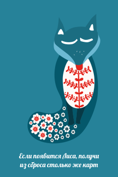

## Описание функций карт
- Лиса и Волк -- игрок берет из сроса столько же карт, сколько снято    

[Карта "Волк"](css/card2.svg)
- Шарики -- все предыдущие карты отправляются в тайник  
[Карта "Шарики"](css/card3.svg)
- Олень -- игрок обязан взять следующую карту, даже если это приведет к проигрышу в ходе  
[Карта "Олень"](css/card4.svg)
